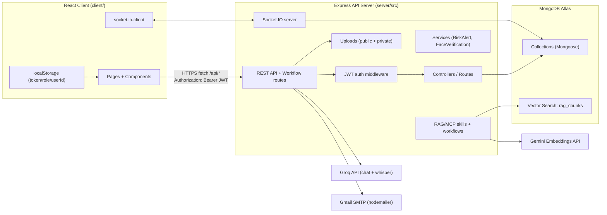
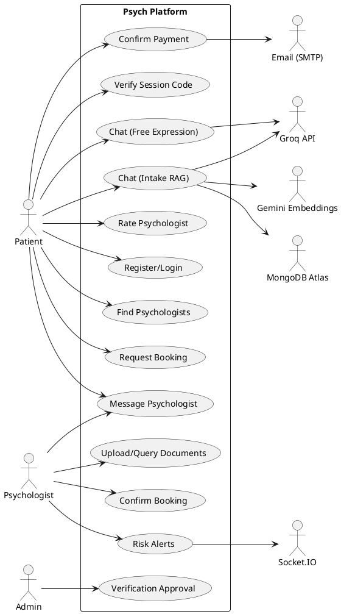
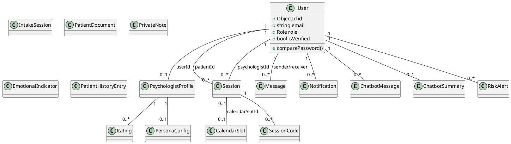

# Psych Platform — Technical Schema (Derivation-Ready)

> Repository: `C:\Users\Mega-PC\psych-platform`  
> Document: `C:\Users\Mega-PC\psych-platform\docs\SCHEMA.md`  
> Generated on: 2026-05-04

This document is intentionally structured so you can derive:
- Use case diagram (actors + use cases + boundaries)
- Class diagram (entities + relationships + key methods)
- Sequence diagrams (step-by-step workflows with actor/action/response)

---

## Step 1 — Understand the Project First

### 1) Inferred Purpose

Psych Platform is a web-based, role-driven psychological intake & therapy coordination platform that enables:
- Patients to discover psychologists, request/book time slots, complete an AI-assisted intake/chat, and communicate with their psychologist.
- Psychologists to manage availability, review patient history and AI summaries, exchange messages, upload/analyze documents, and record clinical notes.
- Administrators to oversee users and verify/approve psychologist credential submissions (CV/diploma/ID + intro video), including optional AI and face-match diagnostics.

It also includes an AI subsystem:
- A RAG-powered intake chatbot pipeline (Darija-aware + PDF knowledge base retrieval + risk/manipulation analysis + persona tuning).
- A “platform assistant” chatbot limited to navigation/help (not therapy) via Groq.

### 2) Main Actors (Users + External Systems)

**Human actors**
- **Patient** (`User.role=patient`)
- **Psychologist** (`User.role=psychologist` + `Psychologist` profile document)
- **Administrator** (`User.role=admin`)

**External / system actors**
- **MongoDB Atlas** (primary DB + Vector Search for RAG chunks)
- **Groq API** (chat completions + Whisper transcription)
- **Google Gemini Embeddings API** (vector embeddings via LangChain)
- **Email (Gmail SMTP via Nodemailer)** (session code + notifications)
- **Socket.IO Clients** (real-time messaging + risk alerts)
- **File Storage** (public uploads + private verification uploads)

### 3) Core Features (Evidence-based from code)

- Authentication (JWT) and role-based access control.
- Psychologist directory search (text search + geo “nearby” + rating sort).
- Scheduling:
  - Psychologist publishes availability blocks (>= 1 hour).
  - Patient requests a sub-window (60/90 mins) within a block.
  - Psychologist confirms or rejects; confirmed booking creates a booked sub-slot and splits remaining time into available sub-slots.
  - Payment confirmation starts a 24h code validity window; patient verifies a 6-digit code to activate the session.
- Session lifecycle tracking (pending → pending_payment → paid → active → completed/canceled).
- Real-time messaging (patient ↔ psychologist), gated by “has booked consultation”.
- AI intake chatbot:
  - Stage-based intake protocol (stages 1–5).
  - Darija normalization + embedding + Darija context retrieval.
  - PDF knowledge base retrieval (`rag_chunks` vector store).
  - Risk analysis → RiskAlert + Notification + socket event to psychologist room.
  - Persona config per psychologist (style-only tuning).
  - Persist turns in `ChatbotMessage` and intake state in `IntakeSession`.
- Patient “free expression” chatbot (separate endpoint set) that summarizes conversation into `ChatbotSummary` (+ follow-up questions).
- Clinical tools:
  - Psychologist private notes (per session/patient).
  - Emotional indicators scoring per session.
  - Patient history entries.
  - Patient document upload (PDF) + text extraction + Q&A over extracted text.
- Admin verification workflow:
  - Psychologist uploads CV/diploma + ID images + intro video.
  - AI summary over CV/diploma via Groq.
  - Admin approves/rejects; admin can fetch stored assets and run face-match.

### Assumptions / Clarifications (because code is partially inconsistent)

1) **Payment is simulated/confirmed by API call**: there is no payment gateway integration; `/api/sessions/:id/payment` “confirms” payment and emails a code.
2) **Psychologist identity**: “Psychologist” is represented by:
   - a `User` document (role=psychologist) for authentication and ID references in Sessions, CalendarSlots, etc.
   - a `Psychologist` profile document keyed by `userId`.
3) **ChatbotSummary linkage**: `ChatbotSummary` is stored by `patientId` only, but `reportController` queries it by `sessionId`. To derive diagrams, assume either:
   - `ChatbotSummary` should include `sessionId`, or
   - PDF report should be generated from `patientId` instead of `sessionId`.
4) **User “name” fields**: `User` schema has `email/password/role/isVerified`, but some code populates `patientId` with `name email`. Assume “name” is not currently stored and email is the identifier.

---

## Step 2 — Generate the Schema

## 1. Project Overview

### Purpose of the system
- Provide a secure platform to connect patients and psychologists, manage session scheduling and communication, and augment intake with AI (RAG + dialect awareness + safety monitoring).

### Key functionalities
- JWT auth + role gating
- Psychologist discovery (search, nearby, rating)
- Availability slots + patient booking requests + confirmation flow
- Payment confirmation + email-delivered session codes + session activation
- Session chat (patient ↔ psychologist) + AI chatbot(s)
- Psychologist dashboard (stats, patients, history, notes, emotions)
- Risk alerting (DB + notification + realtime socket event)
- Document upload + text extraction + Q&A
- Admin user management + psychologist verification approval + face-match diagnostics

---

## 2. Actors & Use Cases (Use-Case-Diagram Ready)

### System Boundary
**System:** Psych Platform (Web App + API)

### Actors
- **Patient**
- **Psychologist**
- **Administrator**
- **Email Service (SMTP)**
- **Groq API**
- **Gemini Embeddings API**
- **MongoDB Atlas (DB + Vector Search)**
- **Socket.IO Realtime Channel**
- **File Storage (Public + Private uploads)**

### Use Cases by Actor

#### Patient — Use Cases
- **Register account**
- **Login / Logout**
- **View psychologist directory**
- **Search psychologists**
- **Find nearby psychologists (geo)**
- **View psychologist public profile**
- **Request booking for a time slot**
- **Cancel pending booking request**
- **Confirm payment for a session**
- **Receive session code by email** *(via Email Service)*
- **Verify session code and start session**
- **Use intake chatbot (RAG pipeline)**
- **Use free-expression chatbot**
- **View chatbot messages and summary**
- **Message psychologist (only after booking gate satisfied)**
- **Send voice message (transcribe then send)**
- **View session history**
- **Rate psychologist (after completed session)**
- **View notifications**

#### Psychologist — Use Cases
- **Login / Logout**
- **Create profile**
- **Update profile (bio, languages, location, price, etc.)**
- **Submit verification documents (CV/diploma/ID/video)**
- **Manage availability slots (create/delete)**
- **Review booking requests**
  - **Confirm booking request**
  - **Reject booking request**
- **View dashboard stats**
- **View patients list**
- **View patient details**
  - **View patient session history**
  - **View chatbot summaries**
  - **View risk alerts**
- **Message patient (gated by booked consultation)**
- **End session (mark completed)**
- **Add private clinical notes**
- **Add emotional indicators**
- **Add patient history entries**
- **Upload patient document**
- **Query patient document (Q&A)**
- **Generate patient report PDF** *(see assumption about summary linkage)*
- **Configure chatbot persona**
- **Receive real-time risk alerts** *(via Socket.IO)*

#### Administrator — Use Cases
- **Login / Logout**
- **View platform stats**
- **View all users**
- **Update user role**
- **Delete users**
- **View pending psychologist verifications**
- **Approve psychologist**
- **Reject psychologist**
- **Access verification files/assets**
- **Run face-match verification + view diagnostics**

#### External Systems — Use Cases (supporting)
- **Groq API**
  - Produce platform-assistant responses
  - Produce free-expression chatbot responses
  - Produce credential analysis summaries
  - Transcribe voice messages (Whisper)
  - Produce document Q&A responses
- **Gemini Embeddings API**
  - Generate embeddings for RAG ingestion/retrieval
- **MongoDB Atlas**
  - Persist application data
  - Store vector embeddings for knowledge chunks
  - Provide vector retrieval via Atlas Vector Search
- **Email Service**
  - Send session codes and completion emails
- **Socket.IO**
  - Broadcast chat messages and risk alerts
- **File Storage**
  - Persist uploads (public) and verification assets (private)

---

## 3. High-Level Architecture



### Key runtime boundaries
- **Frontend**: `client/` React app (React Router), fetch wrapper in `client/src/services/api.js`.
- **Backend**: `server/src/index.js` Express + Socket.IO, routes mounted under `/api/*`.
- **DB**: MongoDB Atlas; main app collections via Mongoose; RAG chunk collection `rag_chunks` via MongoDB native driver + LangChain.
- **AI Providers**: Groq (chat & whisper), Gemini (embeddings).
- **Storage**:
  - Public uploads: `server/uploads/` (configurable via `UPLOADS_DIR`)
  - Private uploads: `server/private_uploads/` (configurable via `PRIVATE_UPLOADS_DIR`)

---

## 4. Backend Structure

### 4.1 API Route Map (Base: `server/src/index.js`)

```text
/api/auth
  POST /register
  POST /login
  GET  /me

/api/psychologists
  POST /profile                    (psychologist)
  GET  /                           (public list, approved only)
  GET  /nearby                     (geo + filters)
  GET  /by-user/:userId
  GET  /:id
  PUT  /:id                        (psychologist)
  PUT  /me                         (psychologist)

/api/calendar
  GET    /slots/:psychologistId
  POST   /slots                     (psychologist)
  POST   /slots/:id/book            (patient; legacy alias of request)
  POST   /slots/:id/request         (patient; create pending request + session)
  POST   /slots/:id/confirm         (psychologist; creates booked sub-slot + splits)
  POST   /slots/:id/reject          (psychologist)
  DELETE /slots/:id                 (psychologist)

/api/sessions
  POST /                            (patient; creates session "pending")
  POST /:id/payment                 (patient; confirms payment + emails code)
  POST /:id/verify-code             (patient; activates session)
  GET  /patient/:patientId          (patient/self or admin)
  POST /:id/cancel                  (patient)
  GET  /:id                         (participant or admin)
  PUT  /:id/end                     (psychologist; completes session)

  GET  /:id/report/pdf              (psychologist/admin)  [mounted from reportRoutes]
  POST /:id/voice                   (any auth; voice transcription)

/api/messages
  POST /                            (auth; booking-gated)
  GET  /unread                      (auth)
  GET  /:otherUserId                (auth; booking-gated)
  PUT  /read/:otherUserId           (auth)

/api/dashboard                      (psychologist-focused)
  GET  /stats
  GET  /patients
  GET  /patient/:patientId
  POST /notes
  GET  /notes/:patientId
  GET  /notes/patient/me            (patient)
  POST /emotions
  GET  /emotions/:patientId
  POST /history
  GET  /history/:patientId

/api/chatbot                         (free-expression bot + summaries)
  POST /chatbot
  POST /chatbot/end
  GET  /messages
  GET  /summary
  POST /logout-summary

/api/chat                             (RAG intake workflow)
  POST /                              (RAG pipeline)
  GET  /init

/api/persona
  GET    /                            (psychologist)
  PUT    /                            (psychologist; upsert)
  DELETE /                            (psychologist; reset)

/api/risk-alerts
  GET  /
  GET  /all
  GET  /patient/:patientId
  PUT  /:id/acknowledge

/api/notifications
  GET  /
  PUT  /:id/read
  PUT  /read/all

/api/documents
  POST /upload/:patientId            (psychologist; pdf extract)
  GET  /patient/:patientId
  POST /query/:id                    (Groq Q&A over extracted text)

/api/verification
  POST /upload                       (psychologist; CV/diploma/ID/video)
  GET  /pending                      (admin)
  PUT  /:id/approve                   (admin)
  PUT  /:id/reject                    (admin)
  GET  /file/:filename                (admin; public upload file)
  GET  /asset?path=verification/...   (admin; private/public)
  GET  /face-check/:userId            (admin)
  GET  /face-check-diagnostics        (admin)

/api/admin
  GET    /users                       (admin)
  DELETE /users/:id                   (admin)
  PUT    /users/:id/role              (admin)
  GET    /stats                       (admin)

/api/assistant
  POST /                              (Groq “platform navigation” assistant)
```

### 4.2 Layering (Routes → Controllers → Services → Models)

**Routes**: `server/src/routes/*.js`, `server/src/workflows/chatRoute.js`  
- Own URL structure, auth gates, and request-level wiring.

**Controllers**: `server/src/controllers/*.js`  
- Own business logic for auth, sessions, verification, documents, reporting, etc.

**Services**: `server/src/services/*.js`  
- Cross-cutting orchestrations:
  - `RiskAlertService`: persists `RiskAlert` + `Notification` + emits Socket.IO event
  - `faceVerificationService`: performs model loading + frame extraction + face descriptor compare

**Models (Mongoose)**: `server/src/models/*.js`  
- Define MongoDB collections and relations via refs.

**Skills/Workflows (RAG)**: `server/src/skills/*.js`, `server/src/workflows/*`  
- Compose the intake chatbot pipeline: normalization → embeddings → retrieval → generation → persistence → risk alerting.

### 4.3 Cross-cutting middleware
- `protect` (JWT verification): `server/src/middleware/authMiddleware.js`
- `restrictTo(...roles)` (RBAC): `server/src/middleware/authMiddleware.js`
- Request validation: `server/src/middleware/validateMiddleware.js` (register/login/session/rating)

---

## 5. Database Schema (MongoDB)

> DB technology: MongoDB via Mongoose (plus native driver for RAG vector store).

### 5.1 Collections (Mongoose Models)

#### `users` (`User`)
```js
{
  _id: ObjectId,
  email: String,           // unique
  password: String,        // bcrypt hash
  role: "patient" | "psychologist" | "admin",
  isVerified: Boolean,
  createdAt: Date,
  updatedAt: Date
}
// Methods: comparePassword(candidate)
```
Indexes:
- `email` unique

Relationships:
- `Psychologist.userId → User._id` (1:1)
- `Session.patientId → User._id` (many:1)
- `Session.psychologistId → User._id` (many:1)
- `CalendarSlot.psychologistId/patientId/pendingPatientId → User._id`
- `Notification.userId → User._id`
- `ChatbotMessage.userId → User._id`
- `IntakeSession.userId → User._id`
- `ChatbotSummary.patientId → User._id`
- `RiskAlert.patientId/psychologistId → User._id`

#### `psychologists` (`Psychologist`)
```js
{
  _id: ObjectId,
  userId: ObjectId,        // ref User, unique
  firstName: String,
  lastName: String,
  photo: String,
  bio: String,
  specializations: String[],
  languages: String[],
  city: String,
  location: { type: "Point", coordinates: Number[] }, // [lng, lat]
  averageRating: Number,   // 0..5
  totalRatings: Number,
  availability: String,
  isApproved: Boolean,
  cvUrl: String,
  diplomaUrl: String,
  idCard: { front: String, back: String },            // relative paths
  introVideo: String,       // relative path
  isRejected: Boolean,
  aiVerificationSummary: String,
  sessionPrice: Number,
  createdAt: Date,
  updatedAt: Date
}
```
Indexes:
- `userId` unique
- `location` 2dsphere

#### `calendarSlots` (`CalendarSlot`)
```js
{
  _id: ObjectId,
  psychologistId: ObjectId,  // ref User (psychologist user)
  patientId: ObjectId|null,  // ref User (patient user)
  start: Date,
  end: Date,
  isBooked: Boolean,
  pendingPatientId: ObjectId|null, // ref User
  pendingSessionId: ObjectId|null, // ref Session
  pendingAt: Date|null,
  createdAt: Date,
  updatedAt: Date
}
```
Relationship notes:
- A confirmed booking creates a **new** `CalendarSlot` (booked sub-slot) and deletes the original parent slot; remaining time becomes new “available” sub-slots (>= 1 hour).

#### `sessions` (`Session`)
```js
{
  _id: ObjectId,
  patientId: ObjectId,          // ref User
  psychologistId: ObjectId,     // ref User
  status: "requested" | "pending" | "pending_payment" | "paid" | "verified" | "active" | "completed" | "canceled",
  sessionType: "preparation" | "followup" | "free",
  calendarSlotId: ObjectId|null, // ref CalendarSlot
  scheduledStart: Date|null,
  scheduledEnd: Date|null,
  paymentConfirmed: Boolean,
  paymentDueAt: Date|null,
  confirmedAt: Date|null,
  canceledAt: Date|null,
  isRated: Boolean,
  createdAt: Date,
  updatedAt: Date
}
```

#### `sessionCodes` (`SessionCode`)
```js
{
  _id: ObjectId,
  sessionId: ObjectId,   // ref Session
  code: String,          // 6-digit
  used: Boolean,
  expiresAt: Date,       // TTL index deletes expired docs
  createdAt: Date,
  updatedAt: Date
}
```
Indexes:
- TTL index on `expiresAt`

#### `messages` (`Message`)
```js
{
  _id: ObjectId,
  sessionId: ObjectId|null, // ref Session (optional)
  senderId: ObjectId,       // refPath senderModel
  senderModel: "User" | "Psychologist",
  receiverId: ObjectId,     // refPath receiverModel
  receiverModel: "User" | "Psychologist",
  content: String,
  isRead: Boolean,
  createdAt: Date,
  updatedAt: Date
}
```
Relationship notes:
- Application logic mainly uses `senderId/receiverId` as `User._id` values, even when senderModel is `"Psychologist"`.

#### `notifications` (`Notification`)
```js
{
  _id: ObjectId,
  userId: ObjectId,      // ref User
  title: String,
  message: String,
  link: String,
  type: String,          // e.g. booking_confirmed, booking_canceled, risk_alert
  isRead: Boolean,
  createdAt: Date,
  updatedAt: Date
}
```

#### `privateNotes` (`PrivateNote`)
```js
{
  _id: ObjectId,
  psychologistId: ObjectId, // ref User
  patientId: ObjectId,      // ref User
  sessionId: ObjectId,      // ref Session
  content: String,
  createdAt: Date,
  updatedAt: Date
}
```

#### `emotionalIndicators` (`EmotionalIndicator`)
```js
{
  _id: ObjectId,
  patientId: ObjectId,      // ref User
  psychologistId: ObjectId, // ref User
  sessionId: ObjectId,      // ref Session
  scores: {
    anxiety: Number, sadness: Number, anger: Number, positivity: Number // 0..100
  },
  sessionDate: Date,
  createdAt: Date,
  updatedAt: Date
}
```

#### `patientHistories` (`PatientHistory`)
```js
{
  _id: ObjectId,
  patientId: ObjectId,       // ref User
  psychologistId: ObjectId,  // ref Psychologist (profile)
  sessionType: "Preparation consultation" | "Follow-up between sessions" | "Free expression",
  summary: String,
  emotionalScores: { anxiety:Number, sadness:Number, anger:Number, positivity:Number },
  sessionDate: Date,
  createdAt: Date,
  updatedAt: Date
}
```

#### `patientDocuments` (`PatientDocument`)
```js
{
  _id: ObjectId,
  psychologistId: ObjectId, // ref User
  patientId: ObjectId,      // ref User
  filename: String,         // stored name
  originalName: String,     // user-supplied name
  extractedText: String,
  createdAt: Date,
  updatedAt: Date
}
```

#### `ratings` (`Rating`)
```js
{
  _id: ObjectId,
  patientId: ObjectId,       // ref User
  psychologistId: ObjectId,  // ref Psychologist (profile)
  answers: Number[10],       // each 1..5
  score: Number,             // 10..50
  comment: String,
  createdAt: Date,
  updatedAt: Date
}
```
Indexes:
- unique compound index `{ patientId, psychologistId }`

#### `personaConfigs` (`PersonaConfig`)
```js
{
  _id: ObjectId,
  psychologistId: ObjectId, // ref Psychologist, unique
  tone: "warm"|"neutral"|"formal"|"friendly",
  reflectionLevel: "low"|"medium"|"high",
  questionStyle: "open-ended"|"guided"|"structured",
  directiveness: "low"|"medium"|"high",
  verbosity: "short"|"medium"|"detailed",
  pacing: "slow"|"moderate",
  customGreeting: String,
  createdAt: Date,
  updatedAt: Date
}
```

#### `intakeSessions` (`IntakeSession`)
```js
{
  _id: ObjectId,
  userId: ObjectId,               // ref User (patient)
  currentStage: Number,           // 1..5
  stageTurnCounts: Map<String,Number>, // {"1":0.., ...}
  isComplete: Boolean,
  consecutiveRiskCount: Number,
  lastRiskCategory: String|null,
  startedAt: Date,
  completedAt: Date|null,
  createdAt: Date,
  updatedAt: Date
}
```

#### `chatbotMessages` (`ChatbotMessage`)
```js
{
  _id: ObjectId,
  userId: ObjectId,         // ref User (patient)
  role: "user"|"assistant",
  content: String,
  intakeStage: Number|null, // 1..5 (intake workflow)
  createdAt: Date,
  updatedAt: Date
}
```

#### `chatbotSummaries` (`ChatbotSummary`)
```js
{
  _id: ObjectId,
  patientId: ObjectId, // ref User, unique
  emotionalIndicators: {
    dominantEmotion: String,
    urgencyScore: Number, // 1..5
    sentimentTrend: "improving"|"stable"|"declining"
  },
  keyThemes: String[],
  rawSummary: String,
  recommendations: String[],
  createdAt: Date,
  updatedAt: Date
}
```
Indexes:
- unique `patientId`

#### `riskAlerts` (`RiskAlert`)
```js
{
  _id: ObjectId,
  patientId: ObjectId,        // ref User
  psychologistId: ObjectId,   // ref User
  intakeSessionId: ObjectId,  // ref IntakeSession
  triggerMessage: String,
  riskCategory: "self_harm"|"suicidal_ideation"|"abuse_trauma"|"crisis_escalation",
  riskScore: Number,          // 0..100
  llmReasoning: String,
  severity: "low"|"medium"|"high"|"critical",
  isAcknowledged: Boolean,
  acknowledgedAt: Date|null,
  createdAt: Date,
  updatedAt: Date
}
```

### 5.2 Non-Mongoose Collection (Vector Store)

#### `rag_chunks` (Atlas Vector Search; ingestion via `server/src/workflows/ingestKnowledge.js`)
```js
{
  _id: ObjectId,
  text: String,
  embedding: Number[],        // embedding vector
  metadata: {
    source: String,           // PDF filename
    topic: String,            // e.g. "psychology"
    // plus loader-specific metadata fields (page, loc, etc.)
  }
}
// Vector index name (Atlas): "vector_index"
```

---

## 6. Class Diagram Mapping (Entities → Classes)

### 6.1 Core Domain Classes

```text
Class User
  +id: ObjectId
  +email: string
  +passwordHash: string
  +role: Patient|Psychologist|Admin
  +isVerified: boolean
  +comparePassword(candidate): boolean

Class PsychologistProfile
  +id: ObjectId
  +userId: ObjectId (User)
  +firstName, lastName: string
  +bio, photo, city, availability: string
  +languages: string[]
  +specializations: string[]
  +location: GeoPoint
  +averageRating: number
  +totalRatings: number
  +sessionPrice: number
  +isApproved: boolean
  +verificationAssets: { cvUrl, diplomaUrl, idFrontPath, idBackPath, introVideoPath }

Class CalendarSlot
  +id: ObjectId
  +psychologistId: ObjectId (User)
  +patientId?: ObjectId (User)
  +start, end: Date
  +isBooked: boolean
  +pendingPatientId?: ObjectId (User)
  +pendingSessionId?: ObjectId (Session)

Class Session
  +id: ObjectId
  +patientId: ObjectId (User)
  +psychologistId: ObjectId (User)
  +status: SessionStatus
  +sessionType: Preparation|Followup|Free
  +calendarSlotId?: ObjectId (CalendarSlot)
  +scheduledStart?, scheduledEnd?: Date
  +paymentConfirmed: boolean
  +paymentDueAt?, confirmedAt?, canceledAt?: Date
  +isRated: boolean
  +confirmPayment(): SessionCode
  +verifyCode(code): void
  +end(): void

Class SessionCode
  +id: ObjectId
  +sessionId: ObjectId (Session)
  +code: string
  +used: boolean
  +expiresAt: Date
  +markUsed(): void

Class Message
  +id: ObjectId
  +sessionId?: ObjectId (Session)
  +senderId: ObjectId
  +receiverId: ObjectId
  +content: string
  +isRead: boolean
  +markRead(): void

Class Notification
  +id: ObjectId
  +userId: ObjectId (User)
  +title: string
  +message: string
  +link: string
  +type: string
  +isRead: boolean
  +markRead(): void

Class Rating
  +id: ObjectId
  +patientId: ObjectId (User)
  +psychologistId: ObjectId (PsychologistProfile)
  +answers: number[10]
  +score: number
  +comment: string
  +computeScore(): number

Class PrivateNote
  +id: ObjectId
  +psychologistId: ObjectId (User)
  +patientId: ObjectId (User)
  +sessionId: ObjectId (Session)
  +content: string

Class EmotionalIndicator
  +id: ObjectId
  +patientId: ObjectId (User)
  +psychologistId: ObjectId (User)
  +sessionId: ObjectId (Session)
  +scores: EmotionScores

Class PatientHistoryEntry
  +id: ObjectId
  +patientId: ObjectId (User)
  +psychologistId: ObjectId (PsychologistProfile)
  +sessionType: string
  +summary: string
  +emotionalScores: EmotionScores

Class PatientDocument
  +id: ObjectId
  +psychologistId: ObjectId (User)
  +patientId: ObjectId (User)
  +filename: string
  +originalName: string
  +extractedText: string
  +query(question): string

Class IntakeSession
  +id: ObjectId
  +userId: ObjectId (User)
  +currentStage: number
  +stageTurnCounts: Map<string,number>
  +isComplete: boolean
  +consecutiveRiskCount: number
  +advanceStageIfNeeded(): void

Class ChatbotMessage
  +id: ObjectId
  +userId: ObjectId (User)
  +role: User|Assistant
  +content: string
  +intakeStage?: number

Class ChatbotSummary
  +id: ObjectId
  +patientId: ObjectId (User)
  +emotionalIndicators: {...}
  +keyThemes: string[]
  +rawSummary: string
  +recommendations: string[]

Class RiskAlert
  +id: ObjectId
  +patientId: ObjectId (User)
  +psychologistId: ObjectId (User)
  +intakeSessionId: ObjectId (IntakeSession)
  +riskCategory: string
  +riskScore: number
  +severity: string
  +isAcknowledged: boolean
  +acknowledge(): void

Class PersonaConfig
  +id: ObjectId
  +psychologistId: ObjectId (PsychologistProfile)
  +tone/reflectionLevel/questionStyle/directiveness/verbosity/pacing: string
  +customGreeting: string
```

### 6.2 Relationship Summary (Diagram Edges)
- `User (1) ── (0..1) PsychologistProfile` via `Psychologist.userId`
- `User(patient) (1) ── (0..*) Session` via `Session.patientId`
- `User(psychologist) (1) ── (0..*) Session` via `Session.psychologistId`
- `Session (0..1) ── (0..1) CalendarSlot` via `Session.calendarSlotId`
- `CalendarSlot (0..1) ── (0..1) Session` via `pendingSessionId` (during request) and `calendarSlotId` (after confirmation)
- `Session (1) ── (0..*) SessionCode`
- `User (1) ── (0..*) Notification`
- `User (1) ── (0..*) ChatbotMessage`
- `User (1) ── (0..1) ChatbotSummary`
- `User (1) ── (0..*) RiskAlert` (as patient) and `User (1) ── (0..*) RiskAlert` (as psychologist)
- `PsychologistProfile (1) ── (0..1) PersonaConfig`
- `PsychologistProfile (1) ── (0..*) Rating`
- `User (patient) (1) ── (0..*) PatientDocument`, `PrivateNote`, `EmotionalIndicator`, `PatientHistoryEntry`

---

## 7. Frontend Structure

### 7.1 Routing (React Router)
Defined in `client/src/App.js`:

**Public**
- `/` HomePage
- `/p/psychologist/:id` PublicPsychologistProfile
- `/login`, `/register`

**Patient**
- `/patient/dashboard` PsychologistList
- `/psychologist/:id` PsychologistProfile (authenticated patient)
- `/session/create/:psychologistId` CreateSession
- `/payment/:sessionId` PaymentConfirm
- `/verify/:sessionId` VerifyCode
- `/chatbot/:sessionId` Chatbot
- `/session/:sessionId` SessionPage
- `/my-sessions` / `/history` MySessionHistory
- `/rate/:psychologistId` RateConsultation
- `/notifications` Notifications

**Shared (auth)**
- `/conversation/:otherUserId` Conversation
- `/statistics` Statistics

**Psychologist**
- `/setup` PsychologistSetup
- `/profile/edit` EditProfile
- `/psychologist/dashboard` Dashboard
- `/patient/:patientId` PatientDetail
- `/history/:patientId` PatientHistory
- `/calendar` and `/calendar/:psychologistId` Calendar

**Admin**
- `/admin` AdminPanel

### 7.2 Core Components
- Auth: `components/ProtectedRoute.jsx`, `components/auth/AuthShell.jsx`
- Session UI: `components/session/*` (ChatBox, bubbles, typing, tabs)
- Dashboard UI: `components/dashboard/*` (sidebar, glass panel)
- Notifications: `components/notifications/NotificationsDrawer.jsx`
- AI assistant overlay: `components/AssistantBot.jsx` (calls `/api/assistant`)
- Risk alert banner: `components/RiskAlertBanner.jsx` (calls `/api/risk-alerts`)

### 7.3 State Management
- **Auth state**: `localStorage` (`token`, `role`, `userId`) and `ProtectedRoute` gate.
- **Theme state**: React Context `context/ThemeContext.jsx` + toggle.
- **Server state**: component-level state + custom hooks:
  - `hooks/useChatbotThread.js` (free-expression bot endpoints)
  - `hooks/usePsychologistThread.js` (messages endpoints)

### 7.4 API and Realtime Clients
- REST wrapper: `services/api.js` (fetch + Bearer JWT header)
- Socket client: `services/socket.js` (socket.io-client)

---

## 8. Key Workflows (Sequence-Diagram Ready)

Each workflow step includes:
- **Actor/System**
- **Action**
- **System Response**

### WF-01 — Register & Login
1) **Patient/Psychologist**: Submit `POST /api/auth/register` with `{email,password,role}`  
   **API**: Creates `User`, hashes password, returns `{token,user}`.
2) **Patient/Psychologist/Admin**: Submit `POST /api/auth/login` with `{email,password}`  
   **API**: Verifies password, returns `{token,user}`.
3) **Client**: Stores `token/role/userId` in `localStorage`  
   **UI**: Routes user to role-appropriate pages.

### WF-02 — Psychologist Setup & Verification (Admin Approval)
1) **Psychologist**: Submit profile `POST /api/psychologists/profile`  
   **API**: Creates `Psychologist` document linked to `User`.
2) **Psychologist**: Upload credentials `POST /api/verification/upload` (multipart: `cv,diploma,idFront,idBack,introVideo`)  
   **API**: Stores files (public + private), extracts text, calls Groq for credential analysis, updates `Psychologist.aiVerificationSummary` and asset paths.
3) **Admin**: View pending `GET /api/verification/pending`  
   **API**: Returns psychologists where `isApproved=false` and `isRejected!=true`.
4) **Admin**: Approve `PUT /api/verification/:id/approve` or Reject `PUT /api/verification/:id/reject`  
   **API**: Updates `Psychologist.isApproved/isRejected`.
5) **Admin (optional)**: Run face-match `GET /api/verification/face-check/:userId`  
   **API**: Extracts video frame, compares to ID image using face models, returns `{match,confidence}`.

### WF-03 — Psychologist Publishes Availability Slots
1) **Psychologist**: Select time block in UI and call `POST /api/calendar/slots` `{start,end}`  
   **API**: Validates duration >= 60 mins, creates `CalendarSlot` with `isBooked=false`.
2) **Client**: Refresh slots via `GET /api/calendar/slots/:psychologistId`  
   **API**: Returns sorted slots; patients see only available or their own pending requests.

### WF-04 — Patient Requests a Booking (Pending Request)
1) **Patient**: View psychologist calendar `GET /api/calendar/slots/:psychologistId`  
   **API**: Returns available slots (+ patient’s pending slots).
2) **Patient**: Request slot `POST /api/calendar/slots/:slotId/request` with chosen sub-window (60/90 mins)  
   **API**:
   - Validates slot availability and patient has no open session with same psychologist
   - Creates `Session` with `status=requested` (or equivalent) and sets `scheduledStart/scheduledEnd`
   - Marks parent `CalendarSlot.pendingPatientId/pendingSessionId/pendingAt`
   - Creates `Notification` to psychologist (“booking requested”)
3) **Patient**: Optionally cancel request `POST /api/sessions/:sessionId/cancel`  
   **API**: Cancels session, clears slot pending fields, notifies psychologist.

### WF-05 — Psychologist Confirms Booking (Creates Booked Sub-slot)
1) **Psychologist**: Opens pending request and calls `POST /api/calendar/slots/:slotId/confirm`  
   **API**:
   - Creates a new booked `CalendarSlot` for `[scheduledStart,scheduledEnd]` and sets `patientId`
   - Updates `Session.calendarSlotId`, sets `status=pending_payment`, sets `paymentDueAt = now + 24h`
   - Splits remaining time into new available `CalendarSlot` docs if each remainder >= 1 hour
   - Deletes the original parent slot
   - Creates `Notification` to patient (“booking confirmed; pay within 24 hours”)
2) **Patient**: Receives notification and navigates to payment step.

### WF-06 — Payment Confirmation → Email Code → Session Activation
1) **Patient**: Confirm payment `POST /api/sessions/:sessionId/payment`  
   **API**:
   - Sets `Session.paymentConfirmed=true`, `status=paid`
   - Creates `SessionCode` with `{code,expiresAt=+24h}`
   - Sends email to patient with the 6-digit code
2) **Patient**: Enter code `POST /api/sessions/:sessionId/verify-code` `{code}`  
   **API**:
   - Validates code exists, not used, not expired
   - Marks code as used
   - Updates `Session.status=active`
   - Returns `{success:true}`

### WF-07 — Live Messaging (Patient ↔ Psychologist)
1) **Client**: Join Socket room `join_room(roomId)` for conversation UI (optional)  
   **Socket.IO**: Joins room.
2) **Patient/Psychologist**: Send message `POST /api/messages` `{receiverId,receiverModel,content}`  
   **API**:
   - Enforces booking gate via sessions
   - Persists `Message`
3) **Client**: Load conversation `GET /api/messages/:otherUserId`  
   **API**: Returns ordered message list.
4) **Client**: Mark read `PUT /api/messages/read/:otherUserId`  
   **API**: Updates `Message.isRead=true`.

### WF-08 — RAG Intake Chat (Darija-aware) + Risk Alerts
1) **Patient**: Initialize `GET /api/chat/init`  
   **API**: Loads/creates `IntakeSession`, returns stage name and opening question.
2) **Patient**: Send intake message `POST /api/chat` `{message}`  
   **API workflow**:
   - Load intake protocol + stage config (`LoadIntakeProtocol`)
   - Parallel: `AnalyzeRiskBehavior`, `AnalyzeManipulation`, `LoadPersonaConfig`
   - If risk HIGH: `RiskAlertService.trigger()` creates `RiskAlert` + `Notification` and emits socket event
   - Advance stage if turn limit reached (`AdvanceIntakeStage`)
   - Normalize Darija, embed, retrieve Darija context + PDF knowledge chunks
   - Generate response (`GenerateEmpatheticResponse`)
   - Persist messages + update intake session (`PersistIntakeTurn`)
   - Respond with `{reply,stage,stageName,isComplete,alertTriggered?}`
3) **Psychologist client**: Joins `psychologist_<userId>` room and receives `risk_alert`  
   **UI**: Displays banner; allows acknowledging alert.
4) **Psychologist**: Acknowledge `PUT /api/risk-alerts/:id/acknowledge`  
   **API**: Updates `RiskAlert.isAcknowledged=true`.

### WF-09 — Free-Expression Chatbot + Summary
1) **Patient**: Send `POST /api/chatbot/chatbot` `{message}`  
   **API**: Appends to `ChatbotMessage` history; calls Groq; stores assistant reply.
2) **Patient**: End and summarize `POST /api/chatbot/chatbot/end`  
   **API**: Generates JSON summary → upserts `ChatbotSummary` + recommendations.
3) **Patient/Psychologist**: Fetch summary `GET /api/chatbot/summary` (psychologist can pass `?patientId=`)  
   **API**: Returns `ChatbotSummary`.

### WF-10 — Patient Document Upload + Q&A (Psychologist)
1) **Psychologist**: Upload PDF `POST /api/documents/upload/:patientId` (multipart)  
   **API**: Extracts text from PDF, saves `PatientDocument`, deletes temp upload.
2) **Psychologist**: List docs `GET /api/documents/patient/:patientId`  
   **API**: Returns docs (excluding `extractedText`).
3) **Psychologist**: Ask question `POST /api/documents/query/:docId` `{question}`  
   **API**: Calls Groq with extracted text context; returns `{answer}`.

### WF-11 — Session Completion + Rating
1) **Psychologist**: End session `PUT /api/sessions/:id/end`  
   **API**: Sets `Session.status=completed`, notifies + emails patient to rate.
2) **Patient**: Submit rating `POST /api/ratings` `{psychologistId,answers[10],comment?}`  
   **API**:
   - Requires at least one completed session with that psychologist user
   - Enforces “one rating per pair”
   - Stores `Rating`, recomputes `Psychologist.averageRating/totalRatings`

---

## 9. Data Flow (End-to-End)

### Authentication & Authorization Flow
- Client stores JWT in `localStorage`.
- For most API calls, client sends:
  - `Authorization: Bearer <token>`
- Server middleware `protect` verifies token, populates `req.user = { id, role }`.
- Role gates via `restrictTo(...)` on sensitive routes.

### Scheduling + Session Activation Flow
- Availability stored as `CalendarSlot` blocks.
- Patient request creates:
  - a pending link on the slot (`pendingPatientId`, `pendingSessionId`)
  - a `Session` with chosen scheduled window
- Psychologist confirmation creates:
  - booked sub-slot + remaining available sub-slots
  - updates `Session` to `pending_payment` with due timestamp
- Payment confirmation creates:
  - `SessionCode` + email (SMTP)
- Code verification:
  - marks code used + updates session to `active`

### Messaging Flow
- REST persistence to `Message` collection.
- Optional Socket.IO room usage for near-real-time updates (server also supports simple `send_message` broadcast).

### AI Intake (RAG) Data Flow
- `message` → normalize → embed (Gemini) → retrieve contexts (Darija + rag_chunks) → generate response (LLM) → persist (`ChatbotMessage`, `IntakeSession`) → optional `RiskAlert` + `Notification` + socket event.

### Document Q&A Flow
- PDF upload → extract text → persist as `PatientDocument.extractedText` → Groq Q&A using extracted text as context.

---

## 10. Folder Structure (Project Tree)

> Generated excluding `node_modules/`, `build/`, `.git/`.

```text
client/
  public/
  src/
    assets/
    components/
    context/
    hooks/
    locales/
    pages/
    services/
docs/
  pfe/
  API.md
  CONVENTIONS.md
  PROJECT_ARCHITECTURE.md
  face-verification.md
  use_case_diagram.puml
  SCHEMA.md
models/                         # face-api models for verification
scripts/
server/
  knowledge_base/               # PDFs ingested into rag_chunks
  scripts/
  src/
    controllers/
    data/
    mcp/
    middleware/
    models/
    routes/
    services/
    skills/
    utils/
    workflows/
  uploads/                      # public uploads (plus verification assets)
package.json
README.md
```

---

## Appendix — Diagram Seed Snippets (Optional, for quick generation)

### Use Case Diagram Seed (PlantUML)


### Class Diagram Seed (PlantUML)

