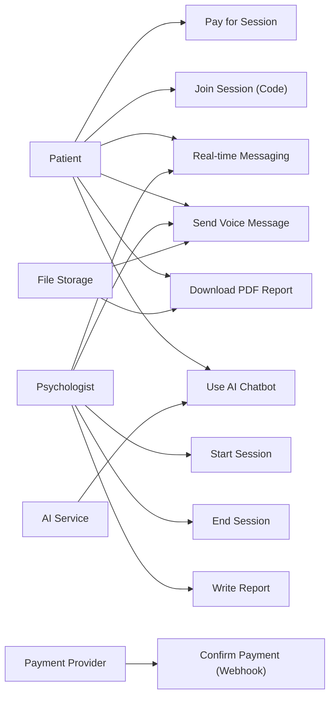
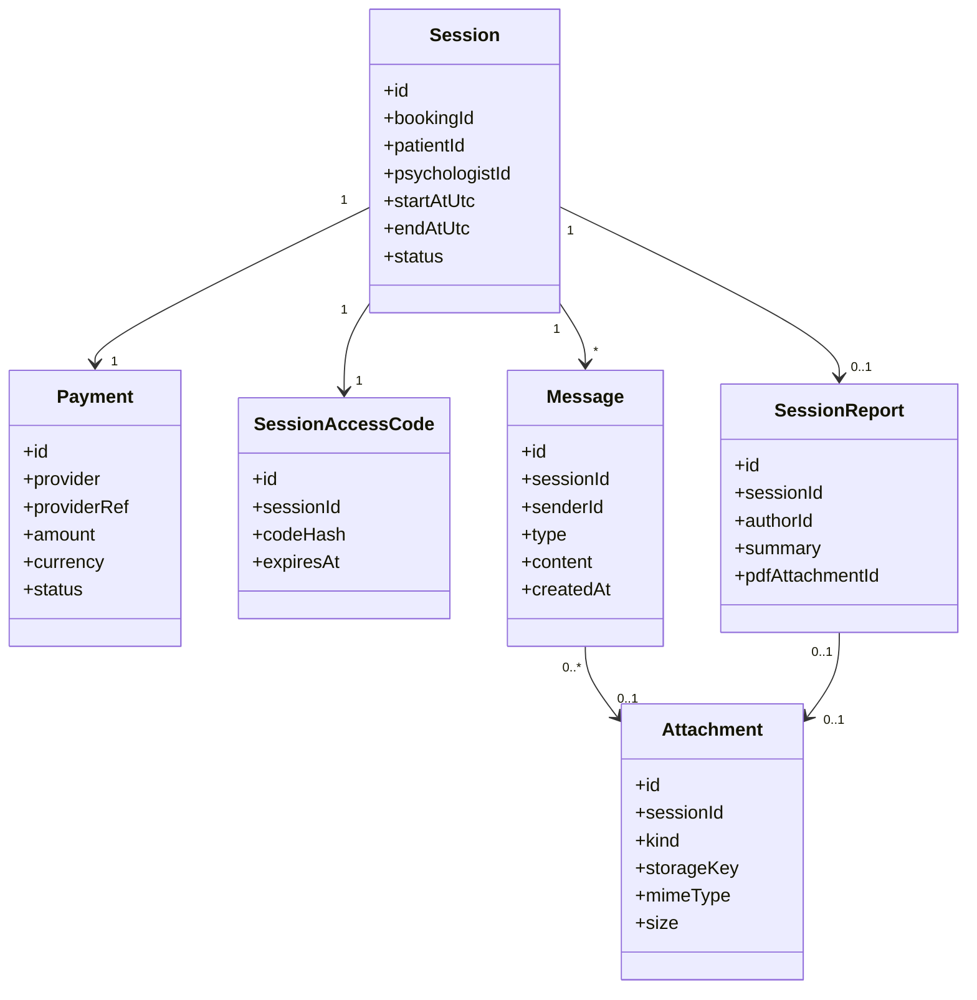
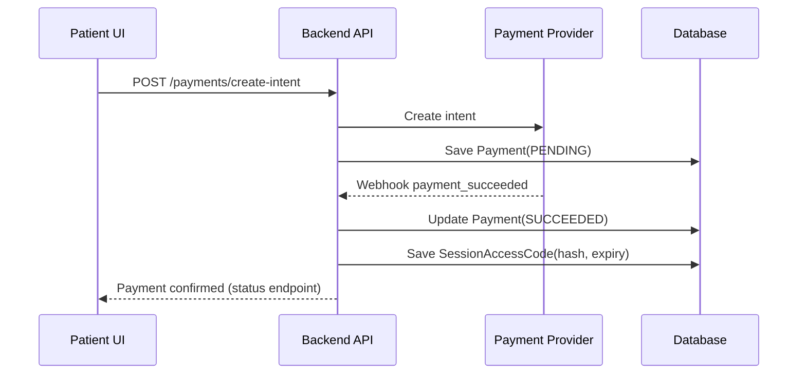
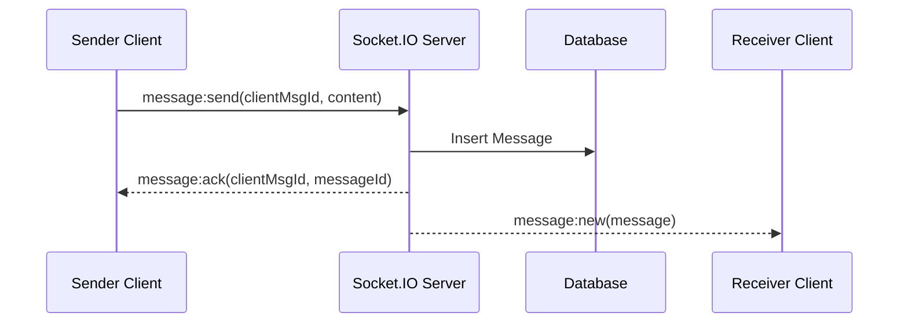

# Introduction
Sprint 4 focuses on building the **core consultation engine** of PsychPlatform. The sprint covers payment-linked session access, a secure session code system, real-time messaging using Socket.IO, voice messages, the full session lifecycle, PDF report generation, and AI chatbot integration to support patient engagement during and after consultations.

This document presents Sprint 4 objectives, planning, backlog, execution approach, analysis, UML-oriented design descriptions (with optional Mermaid), testing, deployment, and sprint review/retrospective elements suitable for a PFE/project report.

# Sprint4Objective
The objective of Sprint 4 is to deliver a secure and auditable consultation experience that:

- Enables **session payment** and generates a **secure session code** used to authorize session entry.
- Provides **real-time messaging** between patient and psychologist via **Socket.IO**.
- Supports **voice message exchange** with secure upload, playback, and access control.
- Implements the **session lifecycle**: start → active → end → report.
- Generates a **PDF session report** (summary, recommendations, session metadata) with controlled access.
- Integrates an **AI chatbot** to assist patients during/after sessions within defined safety boundaries.

Success criteria:
- Only paid/authorized users can join a session and exchange messages.
- Messages (text and voice) are delivered reliably and persisted.
- Session status transitions are consistent and auditable.
- A PDF report is generated and accessible to authorized users only.
- AI chatbot operates with clear constraints and traceable interactions.

# SprintPlanning4
Sprint planning assumptions:
- Sprint duration: 2 weeks (adjustable).
- Dependencies: Sprint 3 delivered booking; Sprint 2 delivered onboarding/approval; only active psychologists can conduct sessions.
- Roles: Product Owner, Backend Developer(s), Frontend Developer(s), QA, DevOps, and a domain reviewer for safety policies.

Planned deliverables:
- Payment initiation/confirmation flow and session code generation.
- Socket.IO server integration and client real-time messaging UI.
- Voice message upload/playback pipeline and storage strategy.
- Session lifecycle endpoints and UI states.
- PDF report generation pipeline and secure delivery.
- AI chatbot integration (in-session and post-session support, configurable).

# SprintBacklog4
## User Stories (Payment and Secure Code System)
1. **US-4.1: Patient pays for a session**
   - As a patient, I want to pay for a scheduled session so that I can access the consultation features.
   - Acceptance criteria:
     - Payment intent is created and confirmed through a payment provider.
     - Payment status is stored and linked to the booking/session.
     - Failure states are handled with clear feedback and retry options.

2. **US-4.2: Generate and validate a secure session code**
   - As the system, I want to generate a secure code after payment so that only authorized users can join the session.
   - Acceptance criteria:
     - Code is unique, time-bound, and associated with a specific session.
     - Code validation is required before joining real-time communication.
     - Codes cannot be reused outside the intended session scope.

## User Stories (Real-time Messaging with Socket.IO)
3. **US-4.3: Real-time text messaging**
   - As a patient/psychologist, I want to send and receive messages in real-time during a session so that communication is immediate.
   - Acceptance criteria:
     - Messages are delivered via Socket.IO events and persisted to the database.
     - Delivery acknowledgements are supported (client receives confirmation).
     - Authorization is enforced: only session participants can connect and emit events.

4. **US-4.4: Presence and session room management**
   - As the system, I want to manage session rooms and participant presence so that the UI reflects who is connected.
   - Acceptance criteria:
     - Users join a session-specific room after authorization.
     - Presence updates (join/leave) are broadcast to the room.
     - Disconnections are handled gracefully with reconnection support.

## User Stories (Voice Message Exchange)
5. **US-4.5: Send voice messages**
   - As a patient/psychologist, I want to send voice messages so that I can communicate when typing is difficult.
   - Acceptance criteria:
     - Client can record audio, upload it securely, and send a message referencing the file.
     - Playback is available to authorized participants.
     - File size, duration, and format constraints are enforced.

## User Stories (Session Lifecycle and Reporting)
6. **US-4.6: Start and activate session**
   - As a psychologist, I want to start a session so that the consultation can formally begin.
   - Acceptance criteria:
     - Session can only start within a defined time window around the booking time.
     - Session status transitions to `ACTIVE` and is broadcast to participants.

7. **US-4.7: End session and generate report**
   - As a psychologist, I want to end the session and provide a structured summary so that the patient receives a report.
   - Acceptance criteria:
     - Ending a session transitions status to `ENDED`.
     - Psychologist can enter report content (notes, recommendations, next steps).
     - System generates a PDF report and stores it securely.

8. **US-4.8: Patient accesses session report**
   - As a patient, I want to download my session report so that I can review outcomes and recommendations.
   - Acceptance criteria:
     - Only session participants can access the report.
     - Download uses secure links (time-limited signed URL).
     - Access is logged for auditability.

## User Stories (AI Chatbot Integration)
9. **US-4.9: AI assistance during and after sessions**
   - As a patient, I want AI assistance during/after sessions so that I can get supportive guidance and reminders.
   - Acceptance criteria:
     - AI chatbot is clearly marked as supportive, not a replacement for professional advice.
     - AI can reference session-safe context (e.g., general topic tags) depending on privacy policy.
     - Safety rules are enforced (crisis escalation guidance, refusal for unsafe requests).

Engineering tasks:
- Implement payment provider integration and webhook handling.
- Implement session code generation, hashing, expiration, and validation.
- Implement Socket.IO gateway with authenticated handshake and room-based authorization.
- Implement message persistence, acknowledgements, and retry/idempotency strategies.
- Implement voice storage pipeline (upload, transcode if needed, signed playback URLs).
- Implement PDF generation service and secure storage.
- Implement AI chatbot integration with logging and guardrails.

# SprintExecution
Execution approach:
- **Security-first:** implement authorization, payment confirmation, and session code validation before real-time features.
- **Incremental real-time delivery:** start with text messaging + presence, then add voice messages.
- **Lifecycle alignment:** ensure the session lifecycle gates features (e.g., chat allowed only when session is active).
- **Asynchronous processing:** run PDF generation and optional audio processing in background jobs to keep APIs responsive.

Definition of Done (DoD):
- Features satisfy acceptance criteria and are covered by tests for critical paths.
- Socket.IO connections are authenticated and cannot access unauthorized rooms.
- File uploads (voice and PDF) are stored securely; access is controlled and logged.
- Session lifecycle states and events are auditable.
- Deployed to a staging/review environment.

# Analysis
Sprint 4 introduces real-time communication and sensitive artifacts (audio and reports). The analysis decomposes requirements into controlled workflows with strict access rules and a well-defined data model.

## UserStoryDeconstructionandRequirementsElicitation
### Functional Requirements
**Payment and session access**
- Create payment intent for a booking/session and confirm payment status.
- Generate a session code after payment; validate code on join.
- Bind access to session participants only (patient + psychologist).

**Real-time messaging (Socket.IO)**
- Authenticated connection using access tokens (JWT/session cookies).
- Room structure: one room per session (e.g., `session:{sessionId}`).
- Events for message send/receive, message acknowledgements, presence, and session status updates.

**Voice messages**
- Client records audio → uploads to storage → emits a message with file reference.
- File constraints: allowed codecs (e.g., `audio/webm`, `audio/ogg`, `audio/mpeg`), max duration/size.
- Secure playback: signed URL or proxied stream; no public buckets.

**Session lifecycle**
- Start session within a defined time window; set status `ACTIVE`.
- End session sets status `ENDED` and triggers report creation.
- Report finalization sets status `REPORTED` (optional) and stores artifacts.

**PDF report generation**
- Generate PDF from a structured report template.
- Store PDF in secure object storage with metadata and integrity hash.
- Provide authorized download and audit access.

**AI chatbot integration**
- Provide chatbot UI channel (in-session and/or post-session).
- Apply safety constraints: crisis guidance, refusal rules, and clear disclaimers.
- Log prompts/responses with privacy-aware storage and access rules.

### Non-Functional Requirements
- **Security & privacy:** RBAC, signed URLs, encrypted storage, secret management for payment/AI providers.
- **Reliability:** message delivery acknowledgements; reconnection handling; webhook retries.
- **Consistency:** session and booking state machine alignment; idempotent webhook handlers and message persistence.
- **Performance:** low-latency sockets; background jobs for PDF/audio processing; efficient pagination for message history.
- **Auditability:** immutable event logs for payment status changes, session transitions, report access, and admin overrides.

### Workflow Constraints and Policies
- Session chat is permitted only for authorized participants and may be gated by session status (`ACTIVE`).
- Payment must be confirmed before issuing a valid session code.
- Voice and PDF files must not be directly accessible without authorization checks.
- AI chatbot must not expose sensitive therapist notes unless explicitly allowed by policy.

## TechnologyStackandIntegrationHighlights
Key integration highlights:
- **Payment provider integration**
  - Payment intents and confirmation via provider APIs.
  - Webhooks to confirm final status and prevent client-side spoofing.

- **Real-time architecture (Socket.IO)**
  - Socket.IO server attached to backend (or separate gateway service).
  - Authenticated handshake (token-based).
  - Room-based authorization and event-driven updates.
  - Optional scaling: Redis adapter for multi-instance deployments.

- **Backend APIs and database**
  - APIs for session creation/start/end, code validation, message history, report retrieval.
  - Database tables/collections for sessions, payments, codes, messages, attachments, reports, and audit logs.

- **File handling (voice + PDF)**
  - Object storage with pre-signed upload/download URLs.
  - Background worker for PDF generation and optional audio transcoding.
  - Metadata: MIME type, size, checksum, duration (audio), and access scope.

- **AI chatbot integration**
  - Dedicated service wrapper for chat completions.
  - Safety pipeline: prompt filtering, crisis detection, and response constraints.
  - Logs stored with minimization and retention rules.

## AnalysisConclusion
Sprint 4 requires combining secure payment authorization, real-time messaging, and artifact generation into a consistent session lifecycle. A robust design uses:
- A strict state machine (booking → paid session → active → ended → reported),
- authenticated Socket.IO rooms with persisted message history,
- secure file storage for voice and PDF,
- asynchronous workers for heavy processing,
- and AI integration with enforceable safety policies and auditing.

# Design (UML diagrams)
This section describes UML artifacts textually and includes optional Mermaid diagrams for clarity.

## OverallUseCaseDiagramforSprint4
Actors:
- **Patient**
- **Psychologist**
- **Payment Provider (external)**
- **AI Service (external)**
- **File Storage (external/internal)**

Use cases:
- Patient:
  - Pay for Session
  - Join Session (with secure code)
  - Send/Receive Messages (text, voice)
  - Use AI Chatbot
  - View/Download PDF Report
- Psychologist:
  - Start Session
  - Send/Receive Messages (text, voice)
  - End Session
  - Write Session Report
- Payment Provider:
  - Confirm Payment (webhook)
- AI Service:
  - Generate Chatbot Response
- File Storage:
  - Store Voice Files and PDF Reports

Optional Mermaid (use case diagram approximation):

## DetailedUseCaseSpecifications
### Use Case: Pay for Session
- **Primary actor:** Patient
- **Preconditions:** Booking exists and is payable; patient authenticated
- **Main flow:**
  1. Patient initiates payment from booking details.
  2. Backend creates a payment intent with the payment provider.
  3. Patient completes payment via provider flow.
  4. Provider sends webhook confirmation to backend.
  5. Backend marks payment as `SUCCEEDED` and enables session code issuance.
- **Alternate flows:**
  - Payment failed/cancelled: backend stores final status and allows retry.
  - Webhook delayed: UI displays “pending confirmation”.
- **Postconditions:** Payment record persisted and auditable.

### Use Case: Join Session with Secure Code
- **Primary actor:** Patient or Psychologist
- **Preconditions:** Payment succeeded; session exists; user is a participant
- **Main flow:**
  1. User enters/uses session code (or the code is embedded in a secure join link).
  2. Backend validates code (hashed match, expiry, session binding).
  3. Backend issues a short-lived socket authorization token or confirms eligibility.
  4. Client connects to Socket.IO and joins `session:{id}` room.
- **Alternate flows:**
  - Invalid/expired code: join denied and logged.
  - Unauthorized user: join denied and logged.
- **Postconditions:** User is connected to the session room with correct permissions.

### Use Case: Real-time Text Messaging
- **Primary actor:** Patient or Psychologist
- **Preconditions:** Connected to authorized room; session status allows messaging
- **Main flow:**
  1. Client emits `message:send` with content and client message id.
  2. Server validates authorization and persists message.
  3. Server emits `message:new` to room and `message:ack` to sender.
  4. Client updates UI state and delivery indicators.
- **Postconditions:** Message stored and delivered to both participants.

### Use Case: Voice Message Exchange
- **Primary actor:** Patient or Psychologist
- **Preconditions:** Authorized; voice constraints configured; session allows messaging
- **Main flow:**
  1. Client records audio and requests an upload URL.
  2. Backend returns pre-signed upload URL + attachment id.
  3. Client uploads audio file to storage.
  4. Client emits `message:send` referencing attachment id.
  5. Backend verifies attachment ownership and sends `message:new` with playback URL (signed).
- **Alternate flows:**
  - File too large/unsupported: upload rejected; UI shows constraints.
  - Upload incomplete: attachment expires and is cleaned up (optional).
- **Postconditions:** Voice message stored and accessible to participants only.

### Use Case: Start → End Session → Generate Report
- **Primary actor:** Psychologist
- **Preconditions:** Session scheduled; within start window; participants authorized
- **Main flow:**
  1. Psychologist starts session; backend transitions to `ACTIVE`.
  2. Server broadcasts `session:status` to room.
  3. Psychologist ends session; backend transitions to `ENDED`.
  4. Psychologist writes report content (structured form).
  5. Backend triggers PDF generation job; status transitions to `REPORT_PENDING`.
  6. Job generates PDF, stores it, and sets status to `REPORTED`.
  7. Patient can download report via secure link.
- **Alternate flows:**
  - Job failure: status becomes `REPORT_FAILED` and is retryable.
- **Postconditions:** PDF report exists; lifecycle fully recorded.

### Use Case: AI Chatbot Assistance
- **Primary actor:** Patient
- **Preconditions:** Patient authenticated; feature enabled; safety policy configured
- **Main flow:**
  1. Patient submits a question through chatbot UI.
  2. Backend applies safety screening and sends request to AI service.
  3. AI response is filtered/validated and returned to the patient.
  4. Interaction is logged (minimized data) for monitoring and improvement.
- **Alternate flows:**
  - High-risk/crisis signals: chatbot returns crisis guidance and recommends professional/emergency help.
  - Provider outage: fallback message and retry option.
- **Postconditions:** Chat session stored per privacy rules.

## ClassDiagram
Core classes/entities (textual):
- **Session**
  - Attributes: id, bookingId, patientId, psychologistId, startAtUtc, endAtUtc, status
  - Responsibilities: session lifecycle container and authorization scope

- **Payment**
  - Attributes: id, bookingId/sessionId, provider, providerRef, amount, currency, status, createdAt
  - Responsibilities: records payment events and final outcome

- **SessionAccessCode**
  - Attributes: id, sessionId, codeHash, expiresAt, maxAttempts, usedAt (optional)
  - Responsibilities: time-bound access authorization; stored as hash

- **SocketConnection**
  - Attributes: socketId, userId, sessionId, connectedAt, lastSeenAt
  - Responsibilities: runtime presence tracking (typically not persisted long-term)

- **Message**
  - Attributes: id, sessionId, senderId, type (TEXT/VOICE/SYSTEM), content, attachmentId, createdAt
  - Responsibilities: persistent message record; supports pagination/history

- **Attachment**
  - Attributes: id, ownerId, sessionId, kind (VOICE/PDF), storageKey, mimeType, size, checksum, durationSec
  - Responsibilities: secure file metadata for voice and PDFs

- **SessionReport**
  - Attributes: id, sessionId, authorId, summary, recommendations, createdAt, pdfAttachmentId
  - Responsibilities: structured report content and link to generated PDF

- **ChatbotInteraction**
  - Attributes: id, userId, sessionId (optional), promptMeta, responseMeta, riskFlags, createdAt
  - Responsibilities: stores AI interaction metadata under minimization rules

- **AuditLogEntry**
  - Attributes: actorId, action, entityRef, payloadSnapshot, createdAt
  - Responsibilities: traceability for payment updates, joins, session transitions, report access

Associations (summary):
- Session 1..1 Payment (or 1..* if retries are tracked)
- Session 1..1 SessionAccessCode
- Session 1..* Message
- Message 0..1 Attachment
- Session 0..1 SessionReport
- SessionReport 0..1 Attachment (PDF)

Optional Mermaid (class diagram approximation):

## SequenceDiagrams
### Sequence: Payment Confirmation and Code Issuance
Participants: Patient UI → Backend API → Payment Provider → Database
1. UI calls `POST /payments/create-intent` for a booking/session.
2. Backend creates provider intent and stores `PENDING` payment record.
3. Patient completes provider payment flow.
4. Provider calls webhook `POST /payments/webhook`.
5. Backend validates signature, updates payment to `SUCCEEDED`, generates session code hash + expiry.
6. Backend notifies client (polling or webhook-driven update) that session is payable/joinable.

Optional Mermaid:

### Sequence: Socket.IO Connection and Room Join
Participants: Client → Socket.IO Server → Backend Auth → Database
1. Client obtains auth token and session id.
2. Client connects with `auth` payload (token + sessionId/code).
3. Server validates token and verifies user is session participant.
4. Server joins socket to `session:{id}` and emits `presence:update`.

Socket.IO event examples:
- `session:join` (client → server)
- `session:joined` (server → client)
- `presence:update` (server → room)

### Sequence: Send Text Message with Acknowledgement
Participants: Client → Socket.IO Server → Database → Other Client
1. Client emits `message:send` with `clientMsgId` and content.
2. Server validates, persists Message, then emits:
   - `message:ack` to sender (maps `clientMsgId` → `messageId`)
   - `message:new` to room with the stored message payload
3. Receiver UI renders message in real-time.

Optional Mermaid:

### Sequence: Voice Message Upload and Send
Participants: Client → Backend API → Storage → Socket.IO Server → Database
1. Client requests upload URL: `POST /attachments/voice/init`.
2. Backend returns pre-signed upload URL + attachment id.
3. Client uploads audio to storage.
4. Client emits `message:send` with `attachmentId`.
5. Server validates attachment ownership and persists Message; emits `message:new` with signed playback URL.

### Sequence: End Session and PDF Report Generation
Participants: Psychologist UI → Backend API → Database → Worker → PDF Generator → Storage
1. Psychologist calls `POST /sessions/{id}/end`.
2. Backend transitions session to `ENDED` and stores report content.
3. Backend enqueues PDF generation job.
4. Worker renders PDF from template and stores in object storage.
5. Worker updates SessionReport with `pdfAttachmentId`; backend exposes secure download link.

# TestsandDeployment
Sprint 4 includes high-risk areas: payments, real-time messaging, and file artifacts. Testing must verify authorization, idempotency, and lifecycle invariants.

## UnitTestingStrategyandScope
Unit test scope:
- Session code generation/validation (hashing, expiration, attempts).
- Session lifecycle transition guards and time-window rules.
- Message validation (size limits, allowed types) and persistence mapping.
- Attachment metadata validation (MIME, size, duration).
- PDF report template rendering logic (deterministic generation from inputs).
- AI chatbot safety checks (rule-based filters and escalation paths).

## IntegrationTestingAcrossComponents
Integration test coverage:
- Payment flow:
  - create intent, webhook verification, idempotent webhook handling, session code issuance.
- Socket.IO auth and room authorization:
  - unauthorized join attempts rejected and logged,
  - correct event emissions to correct room only.
- Messaging persistence and history:
  - `message:new` is consistent with DB content,
  - message pagination for session history.
- Voice messages:
  - upload init → storage upload → message referencing attachment → playback link generation.
- PDF generation:
  - session end triggers job, PDF stored, secure download for participants only.
- AI chatbot:
  - request handling, provider errors, safety fallback responses, logging rules.

## ManualEnd-to-EndScenarioValidation
Manual scenarios:
1. Patient pays successfully; system confirms via webhook; session code becomes available.
2. Patient joins session with valid code; unauthorized user cannot join.
3. Patient and psychologist exchange real-time text messages; disconnect/reconnect preserves history.
4. Voice message recorded, uploaded, sent, and played back by the other participant.
5. Psychologist starts session; status becomes `ACTIVE` and is reflected in UI.
6. Psychologist ends session; enters report; PDF becomes available; patient downloads it.
7. AI chatbot used after session; verify disclaimers and safety behavior for high-risk prompts.

## DeploymentforContinuousReview
Deployment approach:
- Deploy to staging with feature flags:
  - `realtime_messaging_enabled`
  - `voice_messages_enabled`
  - `pdf_reports_enabled`
  - `ai_chatbot_enabled`
- Configure environment-specific keys and secrets:
  - payment provider secrets + webhook signatures,
  - storage credentials,
  - AI provider keys,
  - Socket.IO scaling layer (Redis adapter) if multi-instance.
- Observability:
  - payment webhook success/error rates,
  - socket connection counts and message latency,
  - upload failures,
  - PDF job success/fail and duration,
  - AI request latency and refusal rates.

# SprintReviewandRetrospective
Sprint review demonstration plan:
- Payment → code issuance → join session.
- Real-time messaging demo: presence + ack + persistence.
- Voice message demo: upload and playback.
- Session lifecycle demo: start → active → end → report generation.
- PDF report download and access control.
- AI chatbot demo with safe and unsafe prompt examples (showing guardrails).

Retrospective prompts:
- Were payment and webhook idempotency issues encountered?
- Did Socket.IO authorization and reconnection behave correctly under unstable networks?
- Were file constraints and storage policies clear and sufficient?
- Did PDF generation meet quality requirements (layout, correctness, confidentiality)?
- Did AI chatbot safety boundaries satisfy stakeholder expectations?

# Conclusion
Sprint 4 delivers the consultation engine by combining payment authorization and secure session access with real-time communication, voice messaging, and controlled session lifecycle management. The addition of PDF reporting and AI chatbot integration provides continuity and post-session support while preserving privacy, auditability, and governance required for a mental health platform.

