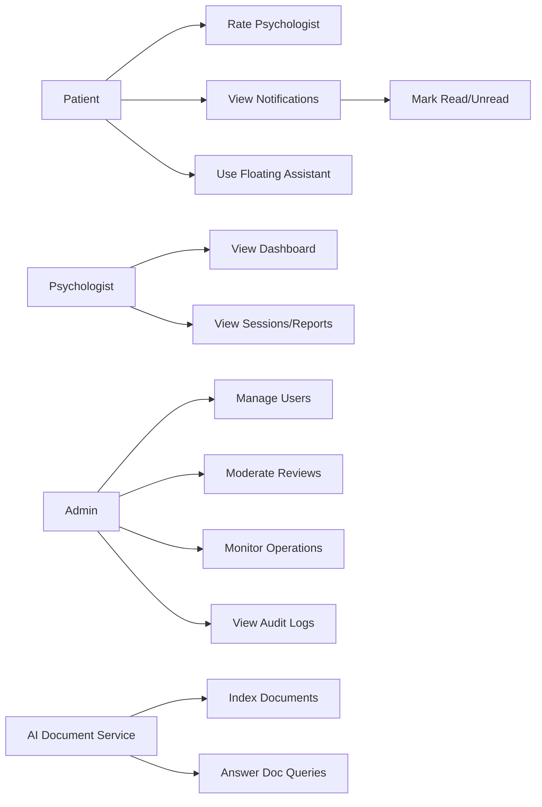
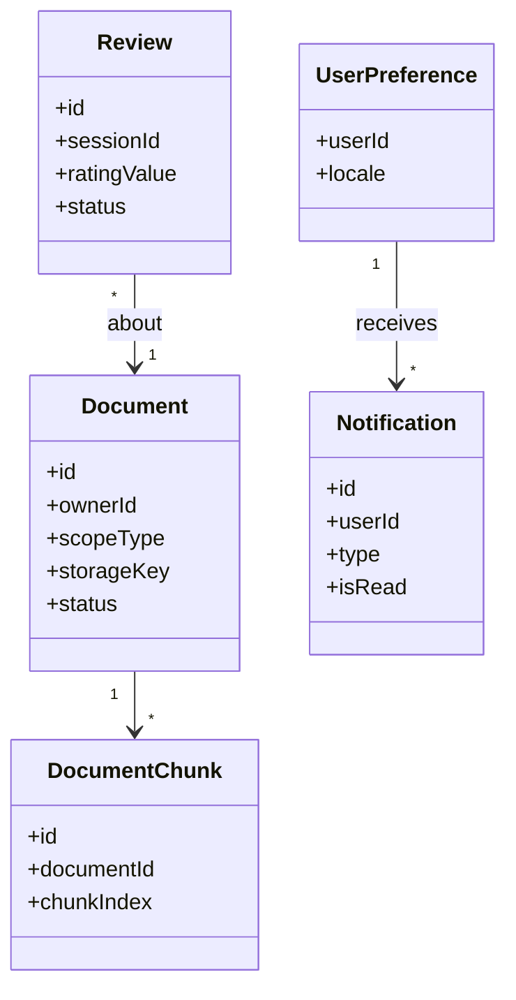
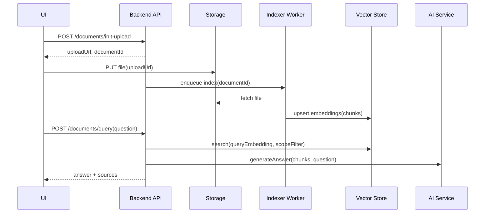
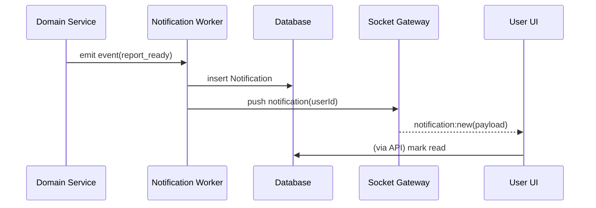

# Introduction
Sprint 5 focuses on **platform enrichment** for PsychPlatform by improving professional and administrative capabilities, user trust signals, multilingual usability, and continuous engagement. The sprint introduces a psychologist dashboard, document AI querying, a ratings system, a broader admin panel, internationalization (EN/FR/AR) with RTL support, a floating assistant, and a real-time/in-app notifications system.

This document presents Sprint 5 objectives, planning, backlog, execution approach, analysis, UML-oriented design descriptions (optionally with Mermaid), testing, deployment, and sprint review/retrospective elements suitable for a PFE/project report.

# Sprint5Objective
The objective of Sprint 5 is to enrich the platform with user-facing and operational features that:

- Provide psychologists with a **dashboard** (analytics, sessions, reports, workload indicators).
- Enable **document AI querying** (upload + intelligent search/Q&A) with strict permission boundaries.
- Implement a **ratings and feedback** system to improve trust and discovery relevance.
- Extend the **admin panel** beyond onboarding (user management, approvals, monitoring, moderation support).
- Deliver **internationalization (i18n)** for EN/FR/AR, including **RTL layout** support.
- Add a **floating assistant** to provide contextual help and AI-driven guidance across the UI.
- Provide a robust **notifications system** (real-time + in-app center) for booking/session/report and admin events.

Success criteria:
- Psychologists can monitor sessions and access reports from a single dashboard.
- Users can query authorized documents safely with explainable results and audit logs.
- Ratings are tied to completed sessions, cannot be spammed, and are moderated by policy.
- Admins can manage users and operational flows with traceability.
- UI is fully usable in EN/FR/AR and supports RTL for Arabic.
- Notifications are delivered reliably with user preferences and read/unread state.

# SprintPlanning5
Sprint planning assumptions:
- Sprint duration: 2 weeks (adjustable).
- Dependencies: Sprint 4 delivered sessions, messaging, reports, and AI chatbot integration; Sprint 3 delivered booking lifecycle.
- Roles: Product Owner, Frontend Developer(s), Backend Developer(s), QA, DevOps, and a domain reviewer for data privacy and AI boundaries.

Planned deliverables:
- Psychologist dashboard views and analytics endpoints.
- Document upload + AI indexing + query endpoints (permission-scoped retrieval).
- Ratings and feedback UI + service endpoints + aggregation.
- Admin panel modules (users, approvals, monitoring, review/moderation tools).
- i18n infrastructure and RTL-ready UI components.
- Floating assistant component integrated into key screens.
- Notifications pipeline (event generation, delivery, in-app center, real-time updates).

# SprintBacklog5
## User Stories (Psychologist Dashboard)
1. **US-5.1: Dashboard overview**
   - As a psychologist, I want a dashboard that summarizes my activity so that I can manage my work efficiently.
   - Acceptance criteria:
     - Shows upcoming sessions, recent sessions, and pending tasks (e.g., reports to finalize).
     - Displays basic analytics (e.g., sessions this week/month, cancellation rate).
     - Links to session details and report library.

2. **US-5.2: Sessions and reports library**
   - As a psychologist, I want to view my session history and reports so that I can reference prior work securely.
   - Acceptance criteria:
     - Session list supports filters (date range, status) and pagination.
     - Reports are accessible only to authorized participants (psychologist + patient) and governed by policy.

## User Stories (Document AI Querying)
3. **US-5.3: Upload documents for AI querying**
   - As a user (patient/psychologist/admin depending on policy), I want to upload documents to a personal workspace so that I can search or ask questions about them.
   - Acceptance criteria:
     - Supported formats (e.g., PDF/text) with size limits and virus/malware scanning if available.
     - Documents are stored securely and tagged with owner and access scope.
     - Upload produces an indexing job for AI querying.

4. **US-5.4: Intelligent search/Q&A over documents**
   - As a user, I want to ask questions about my documents so that I can retrieve relevant information quickly.
   - Acceptance criteria:
     - System returns an answer plus referenced excerpts/sections (traceability).
     - Access is permission-scoped: users cannot query documents they do not own or are not authorized to view.
     - Queries and results are logged with privacy-aware metadata for auditing.

## User Stories (Ratings and Feedback)
5. **US-5.5: Patient rates a psychologist after a completed session**
   - As a patient, I want to leave a rating and feedback after my session so that I can share my experience.
   - Acceptance criteria:
     - Rating can only be submitted for a `COMPLETED` booking/session.
     - One rating per session (update allowed within policy window).
     - Average rating and count are displayed in discovery, respecting moderation rules.

6. **US-5.6: Rating moderation safeguards**
   - As the system/admin, I want safeguards so that ratings cannot be abused.
   - Acceptance criteria:
     - Basic spam prevention (rate limits) and prohibited content checks.
     - Admin can hide/remove a review with a reason; action is audited.

## User Stories (Admin Panel)
7. **US-5.7: Admin user management**
   - As an admin, I want to manage users so that I can ensure platform governance.
   - Acceptance criteria:
     - Search users, view profiles, and change account status (active/suspended) with justification.
     - View onboarding status for psychologists and re-check documents if needed.
     - All actions are recorded in audit logs.

8. **US-5.8: Admin monitoring and operational oversight**
   - As an admin, I want a monitoring panel so that I can detect issues quickly.
   - Acceptance criteria:
     - View system activity indicators (failed payments/webhooks, failed AI jobs, PDF failures, notification failures).
     - Filterable audit log viewer for sensitive actions.

## User Stories (Internationalization EN/FR/AR + RTL)
9. **US-5.9: Switch language**
   - As a user, I want to change the app language so that I can use the platform comfortably.
   - Acceptance criteria:
     - EN/FR/AR translations exist for key flows (auth, booking, sessions, dashboards, admin).
     - Language preference is persisted per user and applied on next login.

10. **US-5.10: RTL support for Arabic**
   - As an Arabic-speaking user, I want the UI to render correctly in RTL so that it is readable and consistent.
   - Acceptance criteria:
     - Layout flips appropriately (navigation, alignment, icons where relevant).
     - Dates/times/numbers are formatted per locale.

## User Stories (Floating Assistant)
11. **US-5.11: Floating assistant for contextual help**
   - As a user, I want a floating assistant so that I can quickly get help or guidance while navigating the platform.
   - Acceptance criteria:
     - Assistant is accessible from most screens and preserves conversation state.
     - Assistant can answer FAQ-style queries and route users to relevant pages/actions.
     - Sensitive data exposure is prevented by access rules.

## User Stories (Notifications System)
12. **US-5.12: In-app notifications center**
   - As a user, I want an in-app notifications center so that I can track events without relying only on email/SMS.
   - Acceptance criteria:
     - Notifications have read/unread state and are grouped by type.
     - Users can open related objects (booking/session/report) from notifications.

13. **US-5.13: Real-time notification delivery**
   - As a user, I want important events to appear in real-time so that I can react quickly.
   - Acceptance criteria:
     - Booking/session status changes trigger notifications.
     - Delivery uses Socket.IO/SSE when online; falls back to polling when offline.

Engineering tasks:
- Define document indexing pipeline (text extraction, chunking, embeddings).
- Implement permission-scoped retrieval for AI Q&A.
- Implement review aggregation and anti-abuse rules.
- Implement i18n/RTL framework setup and translation governance.
- Implement notifications pipeline (event store, queue, delivery workers, real-time gateway).

# SprintExecution
Execution approach:
- **Value-first increments:** deliver notifications + dashboard skeleton early for visible progress.
- **Data governance first:** define permission scopes and audit rules before document AI querying.
- **Localization readiness:** implement i18n foundation and RTL styling before translating all screens.
- **Progressive enhancement:** floating assistant starts as contextual FAQ/navigation; AI depth expands safely.

Definition of Done (DoD):
- New modules are role-protected (patient/psychologist/admin).
- AI document queries are permission-scoped and traceable (sources/excerpts).
- Ratings are session-bound with moderation tooling and audit logs.
- i18n works end-to-end for EN/FR/AR; RTL layout passes UI checks.
- Notifications are durable (stored) and visible (real-time + in-app).
- Deployed to staging for stakeholder review.

# Analysis
Sprint 5 introduces enrichment features that increase platform adoption and operational maturity. The main challenges include (1) permission-scoped AI retrieval, (2) correctness and fairness of ratings, (3) reliable notifications, and (4) consistent multilingual UI behavior including RTL.

## UserStoryDeconstructionandRequirementsElicitation
### Functional Requirements
**Psychologist dashboard**
- Aggregate metrics and lists: upcoming sessions, history, report statuses.
- Provide deep links to session details, reports, and availability adjustments.

**Document AI querying**
- Upload documents to secure storage; extract text (OCR where needed).
- Index content (chunking + embeddings) for semantic retrieval.
- Support question answering with retrieval-augmented generation (RAG):
  - retrieve relevant chunks,
  - generate answer grounded in retrieved text,
  - return references/excerpts for verification.
- Enforce access scopes:
  - user-owned documents (private),
  - session-linked documents (participant-only),
  - admin-only policy documents (restricted).

**Ratings**
- Create rating and optional textual feedback after completed session.
- Aggregate ratings per psychologist and expose to search/discovery.
- Moderation operations (hide/delete) with reasons and audit logs.

**Admin panel**
- User listing/search, status changes, and role checks.
- Operational monitoring for failures across payments, AI jobs, PDFs, sockets, notifications.
- Audit log viewer with filters (actor, action, entity, time range).

**Internationalization + RTL**
- Translation keys for UI text; locale-based formatting for date/time/number.
- Direction switching: `LTR` for EN/FR and `RTL` for AR, including mirrored layout.
- Persist language preference and apply consistently across sessions.

**Floating assistant**
- UI component available across pages; supports lightweight “help” and “actions”.
- Optional AI: uses safe prompts and can route to relevant features without exposing restricted data.

**Notifications**
- Notification generation on domain events:
  - booking confirmed/cancelled,
  - session started/ended,
  - report available,
  - admin decisions/moderation actions (admin-only).
- In-app persistence: store notifications with read/unread state and deep link payload.
- Real-time delivery: socket broadcast to user-specific rooms; fallback retrieval via API.

### Non-Functional Requirements
- **Privacy & security:** strict scoping for documents and AI retrieval; minimize stored AI prompts; encrypt files at rest.
- **Reliability:** notification delivery retries; durable event storage; idempotent consumers.
- **Performance:** dashboard aggregation queries optimized; document indexing asynchronous; pagination across lists.
- **Usability:** consistent UX across languages; RTL styling validated; assistant non-intrusive.
- **Auditability:** admin actions, document access, AI queries, and rating moderation logged.

### Policy and Governance Notes
- AI document Q&A must be constrained to returned sources; avoid hallucinations by grounding responses and returning references.
- Ratings must not expose sensitive health details; enforce content policy and moderation.
- Notifications should avoid leaking sensitive information in push previews (configurable redaction).

## TechnologyStackandIntegrationHighlights
Key integration highlights:
- **Dashboard state management (UI)**
  - Client state: dashboard widgets with loading/error states, caching, and role-based visibility.
  - Server: aggregation endpoints returning consistent DTOs to avoid multiple heavy queries.

- **Document AI querying**
  - Storage: secure object storage for original files.
  - Indexing pipeline:
    - text extraction (PDF parser/OCR),
    - chunking,
    - embedding generation,
    - vector storage (e.g., pgvector/Elasticsearch/vector DB),
    - metadata filters for permission scoping.
  - Query pipeline:
    - semantic retrieval by embedding similarity,
    - reranking (optional),
    - answer generation using retrieved chunks,
    - return citations/excerpts with chunk identifiers.

- **Ratings system**
  - Database constraints: one rating per session per patient.
  - Aggregation: materialized aggregates or cached computed values.
  - Moderation endpoints for admins.

- **Admin panel**
  - Admin-only APIs with audit logging.
  - Monitoring integration with logs/metrics dashboards (or internal summaries).

- **Internationalization and RTL**
  - i18n library in the frontend (key-based translations).
  - Locale stored in user profile; applied via headers/cookies.
  - CSS strategy: logical properties (margin-inline, padding-inline) and direction-aware components.

- **Floating assistant**
  - Frontend overlay component with persistent session state.
  - Backend “assistant” endpoint for safe Q&A and navigation hints.

- **Notifications**
  - Event generation: publish domain events from booking/session/report modules.
  - Event handling: queue/worker to create persistent notifications and optionally send email/SMS.
  - Real-time: Socket.IO emits to `user:{userId}` rooms (or an SSE channel).

## AnalysisConclusion
Sprint 5 enhances platform maturity by adding governance, trust signals, and user experience improvements. The core design principle is **controlled enrichment**: powerful features (AI querying, admin tools, notifications) must be permission-aware, auditable, and reliable, while i18n/RTL ensures inclusivity and usability across languages.

# Design (UML diagrams)
This section provides UML descriptions and optional Mermaid diagrams to support the sprint design.

## OverallUseCaseDiagramforSprint5
Actors:
- **Patient**
- **Psychologist**
- **Admin**
- **AI Document Service (external/internal)**
- **Notification Delivery Service (email/SMS/push, optional)**

Use cases:
- Psychologist:
  - View Dashboard
  - View Sessions and Reports
  - Manage Report Library (access own reports)
- Patient:
  - Rate Psychologist
  - View Notifications
  - Use Floating Assistant
- Admin:
  - Manage Users
  - Moderate Reviews
  - Monitor Operations
  - View Audit Logs
- AI Document Service:
  - Index Documents
  - Answer Queries with Sources
- Notifications:
  - Generate Notifications
  - Deliver Notifications (real-time/in-app and optional channels)

Optional Mermaid (use case approximation):

## DetailedUseCaseSpecifications
### Use Case: Psychologist Dashboard Overview
- **Primary actor:** Psychologist
- **Preconditions:** Psychologist account is active/approved
- **Main flow:**
  1. Psychologist opens dashboard.
  2. System loads widgets (upcoming sessions, recent sessions, reports pending, key metrics).
  3. Psychologist selects an item to navigate to details.
- **Alternate flows:**
  - No data: dashboard shows empty-state guidance.
- **Postconditions:** Dashboard activity may be logged (non-sensitive analytics).

### Use Case: Upload Document for AI Querying
- **Primary actor:** Authorized user (per policy)
- **Preconditions:** Authenticated; storage policy permits uploads for the user role
- **Main flow:**
  1. User initiates upload and selects a document.
  2. Backend validates metadata and returns an upload URL.
  3. Document is stored; backend creates an indexing job.
  4. User sees indexing status until ready.
- **Alternate flows:**
  - Unsupported document: system rejects and explains constraints.
  - Indexing failure: job marked failed and retry is available.
- **Postconditions:** Document is ready for semantic search once indexed.

### Use Case: Ask a Question over Documents (RAG)
- **Primary actor:** Authorized user
- **Preconditions:** Document indexed; user has access to the document scope
- **Main flow:**
  1. User submits a question.
  2. System retrieves relevant chunks within permitted scope using vector search + metadata filters.
  3. System generates an answer grounded in retrieved chunks.
  4. System returns answer plus source excerpts references.
- **Alternate flows:**
  - No relevant content: system returns “no evidence found” and suggests query refinements.
- **Postconditions:** Query is logged (privacy-aware) and auditable.

### Use Case: Rate Psychologist
- **Primary actor:** Patient
- **Preconditions:** Patient completed a session with the psychologist
- **Main flow:**
  1. Patient opens completed session details.
  2. Patient submits rating (e.g., 1–5) and optional feedback text.
  3. System validates eligibility (one per session, anti-abuse rules).
  4. System stores review and updates aggregates.
- **Alternate flows:**
  - Ineligible rating attempt: system blocks and explains reason.
- **Postconditions:** Review is visible per policy and moderation rules.

### Use Case: Admin User Management and Monitoring
- **Primary actor:** Admin
- **Preconditions:** Admin authenticated with required privileges
- **Main flow:**
  1. Admin searches for a user and opens profile details.
  2. Admin changes account status (e.g., suspend) with justification.
  3. Admin reviews operational dashboards for failures and alerts.
  4. Admin uses audit logs to investigate sensitive actions.
- **Postconditions:** Admin actions are fully audited.

### Use Case: Notifications (In-App + Real-Time)
- **Primary actor:** Patient/Psychologist/Admin
- **Preconditions:** User exists; relevant domain event occurs
- **Main flow:**
  1. Domain event occurs (booking confirmed, report ready, etc.).
  2. Notifications service creates a notification record.
  3. If user is online, the system emits a real-time notification event.
  4. User reads notification; state becomes read/unread accordingly.
- **Alternate flows:**
  - Real-time delivery fails: user retrieves notifications via API later.
- **Postconditions:** Notification persists and is visible in notification center.

### Use Case: Internationalization and RTL
- **Primary actor:** Any user
- **Preconditions:** Supported languages configured
- **Main flow:**
  1. User selects language (EN/FR/AR).
  2. UI updates translation bundle and sets direction (RTL for AR).
  3. System stores preference and applies locale formatting.
- **Postconditions:** UI remains consistent and readable across locales.

## ClassDiagram
Entities/classes (textual):
- **DashboardMetric**
  - Attributes: psychologistId, metricKey, value, periodStart, periodEnd
  - Responsibilities: aggregated metrics (may be computed on-demand)

- **Document**
  - Attributes: id, ownerId, scopeType (PRIVATE/SESSION/ADMIN), storageKey, mimeType, size, createdAt, status
  - Responsibilities: document metadata and indexing status

- **DocumentChunk**
  - Attributes: id, documentId, chunkIndex, text, embeddingRef, metadata
  - Responsibilities: chunked text units for retrieval

- **DocumentQuery**
  - Attributes: id, userId, queryText, scopeFilter, createdAt, riskFlags
  - Responsibilities: audit record of document AI queries

- **Review**
  - Attributes: id, sessionId, patientId, psychologistId, ratingValue, comment, status (VISIBLE/HIDDEN), createdAt
  - Responsibilities: rating and feedback with moderation state

- **ReviewModerationAction**
  - Attributes: id, reviewId, adminId, actionType, reason, createdAt
  - Responsibilities: audit of review moderation

- **Notification**
  - Attributes: id, userId, type, payload, isRead, createdAt
  - Responsibilities: in-app persistent notifications

- **NotificationDeliveryAttempt**
  - Attributes: id, notificationId, channel, status, errorCode, attemptedAt
  - Responsibilities: delivery tracking for reliability (optional)

- **UserPreference**
  - Attributes: userId, locale, timeZone, notificationSettings
  - Responsibilities: user configuration including i18n and notifications

Optional Mermaid (class diagram approximation):

## SequenceDiagrams
### Sequence: Document Upload → Indexing → Query (RAG)
Participants: UI → Backend API → Storage → Worker/Indexer → Vector Store → AI Service
1. User requests upload; backend returns pre-signed URL.
2. User uploads to storage; backend marks Document as `UPLOADED`.
3. Backend enqueues indexing job.
4. Worker extracts text, chunks it, generates embeddings, and writes to vector store.
5. Document status becomes `INDEXED`.
6. User asks a question; backend retrieves relevant chunks (permission-scoped) and calls AI.
7. Backend returns answer + source excerpts; query is logged.

Optional Mermaid:

### Sequence: Rate Psychologist After Session
Participants: Patient UI → Backend API → Database → Notification Service
1. Patient submits rating for session.
2. Backend verifies eligibility (session completed, not already rated).
3. Backend stores Review and updates aggregates.
4. Backend optionally notifies psychologist (non-sensitive summary) and/or updates dashboard metrics.

### Sequence: Notification Generation and Real-Time Delivery
Participants: Domain Service → Notification Worker → Database → Socket Gateway → User UI
1. A domain event occurs (e.g., report ready).
2. Notification job creates Notification record.
3. If user is connected, gateway emits `notification:new` to `user:{userId}` room.
4. UI displays toast and updates notification center state.
5. User marks notification read; backend updates isRead flag.

Optional Mermaid:

### Sequence: i18n Locale Switch with RTL
Participants: UI → Backend API → User Preferences Store
1. User selects language (AR).
2. UI loads translation bundle and sets `dir=rtl`.
3. UI calls preference update endpoint.
4. Backend persists locale; subsequent API responses may localize messages if configured.

# TestsandDeployment
Sprint 5 requires tests across AI retrieval boundaries, localization correctness, and notification reliability.

## UnitTestingStrategyandScope
Unit test scope:
- Dashboard aggregation logic (correct filters and time windows).
- Ratings eligibility rules (completed-only, one per session, update window).
- Document indexing pipeline utilities (chunking behavior and metadata handling).
- Permission scoping for retrieval (document visibility rules).
- Notification formatting and state transitions (read/unread).
- i18n: translation key presence and locale formatting utilities.
- RTL: direction-aware layout rules where unit-testable (component snapshots if applicable).

## IntegrationTestingAcrossComponents
Integration tests focus on:
- Document upload → indexing job → query endpoint returns sources and respects permissions.
- Ratings creation affects psychologist aggregates and visibility in discovery endpoints.
- Admin moderation actions hide reviews and are logged.
- Notifications:
  - persistent storage,
  - real-time delivery to connected users,
  - fallback retrieval via API when offline.
- i18n/RTL:
  - language switch persistence,
  - correct rendering of RTL layouts on key screens,
  - correct date/time formatting.

## ManualEnd-to-EndScenarioValidation
Manual validation scenarios:
1. Psychologist opens dashboard and verifies upcoming sessions and report tasks.
2. Patient completes a session and submits a rating; verifies it appears in discovery and can be moderated.
3. Upload a document, wait for indexing, then ask a question; verify sources are shown and cross-user access is blocked.
4. Admin suspends a user with reason; verify audit log entry exists.
5. Switch UI to Arabic; verify RTL layout and locale formatting across booking/session pages.
6. Trigger a notification (report ready) and verify toast + in-app center + read/unread behavior.
7. Open floating assistant and request contextual help; verify it routes to relevant pages without exposing restricted data.

## DeploymentforContinuousReview
Deployment approach:
- Deploy behind feature flags:
  - `dashboard_enabled`
  - `doc_ai_query_enabled`
  - `ratings_enabled`
  - `admin_panel_enabled`
  - `i18n_enabled` and `rtl_enabled`
  - `floating_assistant_enabled`
  - `notifications_enabled`
- Operational readiness checks:
  - background workers for indexing and notifications are running,
  - vector store connectivity verified,
  - translation bundles validated for missing keys,
  - monitoring dashboards configured for job failures and socket delivery.

# SprintReviewandRetrospective
Sprint review demonstration plan:
- Psychologist dashboard walkthrough (sessions + reports + metrics).
- Document AI querying demo: upload, indexing status, Q&A with sources and permission enforcement.
- Ratings demo: post-session rating and discovery display; moderation example in admin panel.
- Admin panel demo: user management, monitoring view, audit logs.
- i18n demo: language switch EN/FR/AR and RTL layout validation.
- Floating assistant demo: contextual help + navigation suggestions.
- Notifications demo: real-time toast + in-app notification center with read/unread.

Retrospective prompts:
- Did AI retrieval stay within strict permission boundaries in all cases?
- Were indexing and notification jobs reliable under load?
- Did RTL changes cause regressions in existing UI components?
- Did the admin panel provide enough operational visibility for incidents?
- Are review/rating policies fair and resistant to abuse?

# Conclusion
Sprint 5 enriches PsychPlatform with operational maturity and user experience improvements. The psychologist dashboard improves professional workflow visibility, document AI querying increases productivity while respecting privacy, ratings strengthen trust, the admin panel supports governance, i18n/RTL broadens accessibility, the floating assistant improves navigation and support, and notifications provide timely engagement across the platform.

