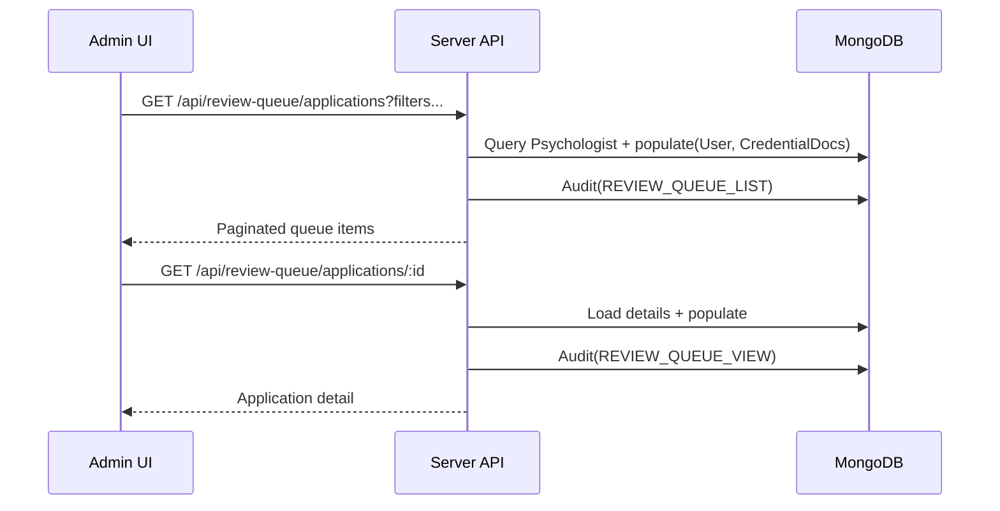

# UC-08 — Admin Review Queue (Browse & Filter)

## Overview

The admin review queue lists psychologist onboarding applications and supports pagination, filtering, sorting, and text search.

This queue is **admin-only** and guarded by role-based access control with optional fine-grained privileges.

## Data Model

- `Psychologist`
  - `profileStatus`: `Draft | Submitted | Approved | Rejected`
  - `submittedAt`: first submission time (used for default sorting)
  - `lastResubmittedAt`: updated on resubmission after rejection
  - `isRejected`, `rejectionReason`, `rejectedAt`
  - `credentialDocs`: references `CredentialDocument` for `cv`, `diploma`, `idFront`, `idBack`, `introVideo`
- `CredentialDocument`
  - Versioned replacements per `ownerUserId + type` with `isCurrent` and `replacedBy`
- `User`
  - `role`
  - optional `adminPermissions[]` (legacy-safe)

## API

### List applications

`GET /api/review-queue/applications`

Query params:
- `page` (int, default `1`)
- `limit` (int, default `20`, max `50`)
- `status` (`Draft|Submitted|Approved|Rejected`)
- `rejected` (`true|false`)
- `completeness` (`complete|docs_only|incomplete`)
- `dateFrom` (ISO date or `YYYY-MM-DD`)
- `dateTo` (ISO date or `YYYY-MM-DD`)
- `search` (string; matches name, email, city)
- `sortBy` (`submittedAt|createdAt`, default `submittedAt`)
- `order` (`asc|desc`, default `desc`)

Response:
- `page`, `limit`, `total`, `items[]`
- Each item includes safe summary fields plus `credentialDocs` metadata (no file storage paths).

Audit:
- Writes `REVIEW_QUEUE_LIST` events.

### Application detail

`GET /api/review-queue/applications/:id`

Response:
- Safe detail fields including `credentialDocs` metadata, onboarding history, and rejection details.

Audit:
- Writes `REVIEW_QUEUE_VIEW` events.

## Authorization / RBAC

- Requires `protect` + `restrictTo('admin')`
- Also checks optional privilege `ONBOARDING_REVIEW` via `requireAdminPermission('ONBOARDING_REVIEW')`
  - Backward compatible: if an admin has an empty `adminPermissions[]`, access is allowed (role-only deployments).

## Indexing

Indexes added on `Psychologist`:
- `{ profileStatus: 1, submittedAt: -1 }`
- `{ profileStatus: 1, createdAt: -1 }`
- `{ isRejected: 1, rejectedAt: -1 }`

## Risk level

The current codebase risk system (`RiskAlert`, chat risk analysis) is session-focused and not tied to onboarding.
`riskLevel` filtering is **not supported** for onboarding review queue endpoints.

## Workflow diagram

