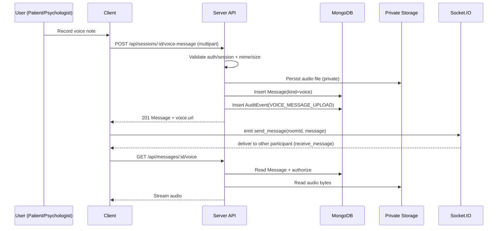

# UC-13 — Voice Messaging

## Summary

Voice messages allow session participants (patient + psychologist) to record, upload, store, and play short audio notes securely during an **active** session.

## Backend

### Upload voice message

`POST /api/sessions/:id/voice-message`

- Auth: `protect`
- Authorization: requester must be the `patientId` or `psychologistId` of the session **and** session `status === active`
- Validation:
  - MIME: `audio/webm`, `audio/ogg`, `audio/mpeg`/`audio/mp3`, `audio/wav`, `audio/mp4`
  - Size: max `5MB`
  - Duration: best-effort via ffprobe, max `30s` (if duration is detectable)
- Storage: private uploads under `voice_messages/<sessionId>/...` (never exposed)
- Creates a `Message` record with:
  - `kind: "voice"`
  - `voice.mimeType`, `voice.sizeBytes`, `voice.durationMs`, `voice.storagePath`
- Audit events:
  - `VOICE_MESSAGE_UPLOAD` (success/failure)

### Stream voice message

`GET /api/messages/:id/voice-access-url` (auth) → returns signed URL

`GET /api/messages/voice-download?token=...` (no auth header; possession of token authorizes)

`GET /api/messages/:id/voice` (auth, protected stream; mainly for programmatic access)

- Auth: `protect`
- Authorization:
  - if message has `sessionId`: requester must be a session participant (any session state)
  - else: requester must be sender or receiver
- Response: streams the audio with `Content-Type` set from stored MIME type
- Audit events:
  - `VOICE_MESSAGE_DOWNLOAD` (success/failure)
  - `VOICE_MESSAGE_DOWNLOAD_DENIED` on unauthorized access
  - `VOICE_MESSAGE_ACCESS_URL_ISSUED` / `VOICE_MESSAGE_ACCESS_URL_DENIED`

### Notes

The existing transcription endpoint remains available:

`POST /api/sessions/:id/voice` → returns `{ text }` (voice-to-text).

## Frontend

- Recording uses `MediaRecorder` and uploads the recorded blob to `/api/sessions/:id/voice-message`.
- Voice messages render inline with an `<audio controls>` player.
- Permission denied: UI falls back to text messaging and shows guidance.

## Diagrams

